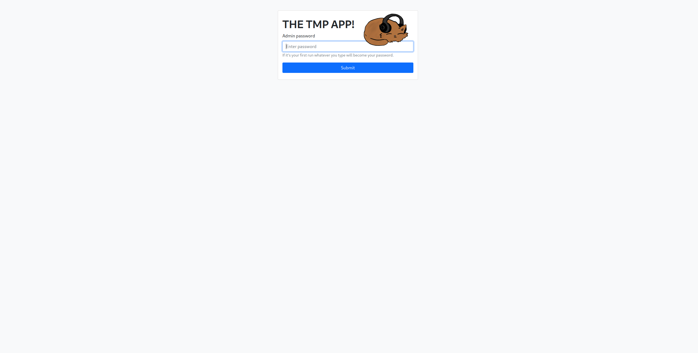
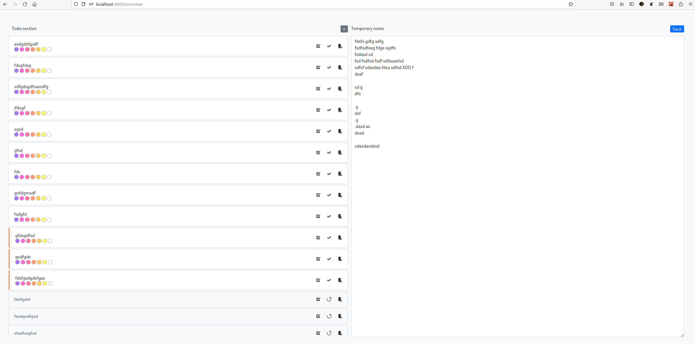

**This repository was archived!**

Suprisingly I actually used that app for almost a year now but I found better solution for what it was doing and also it was a side project to try to implement logic I know from springboot in nodejs using functionall approach I know from react development. At the end of the day it was fun project and I got what I needed from it and its time to move on.

---

# Developing

This repository contains both frontend and backend code.

**NPM COMMANDS**

-   `npm start` - runs backend and frontend app with splited terminal (both are in watch mode)
-   `npm run frontend` - runs only fronted
-   `npm run backend` - runs only backend
-   `npm run inspect-db` - inspect ur sqlite3 db (u need to have sqlite installed and run backend app at least once to create db file)
-   `npm run clean-db` - removes db file

# Database

Since this project is very simple and I want to keep it as minimalistic as possible (that is also why single repo for backend and frontend) used database is `sqlite`. For it naming convention is pretty straightforward:

-   plurar table names
-   singular column names
-   PascalCase for every name
-   each name should be single word
